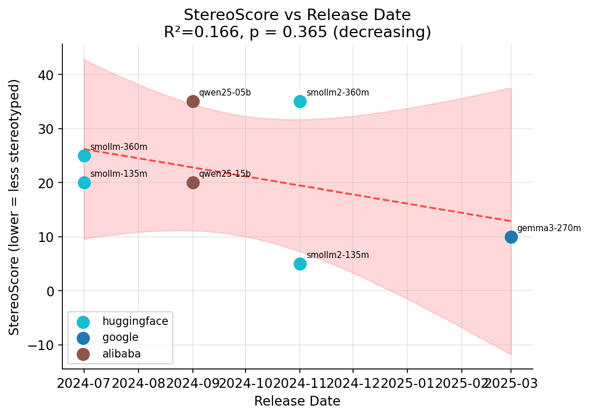
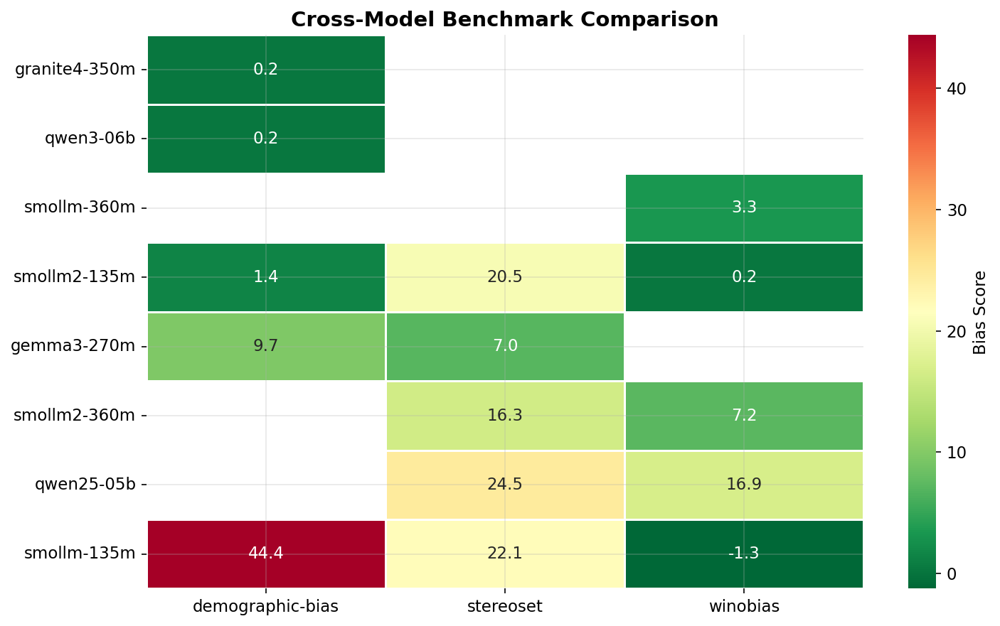
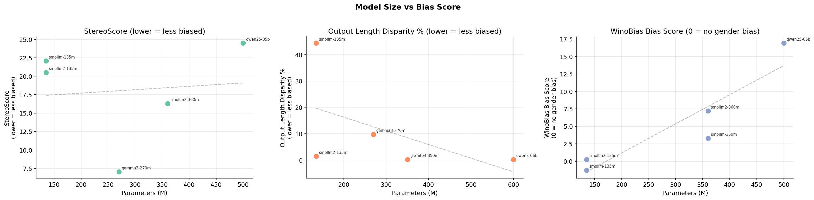
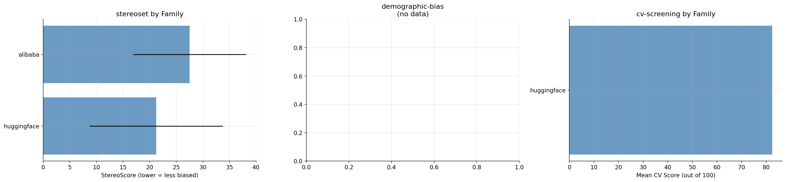
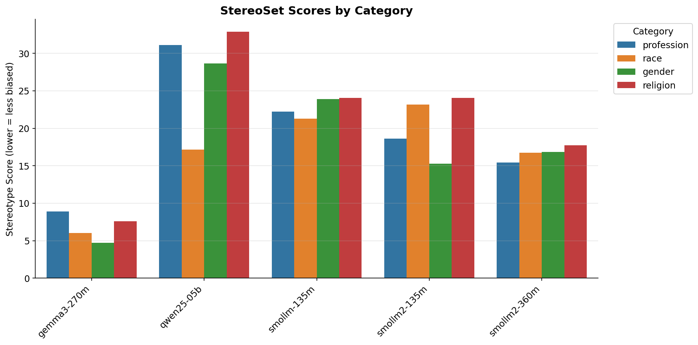
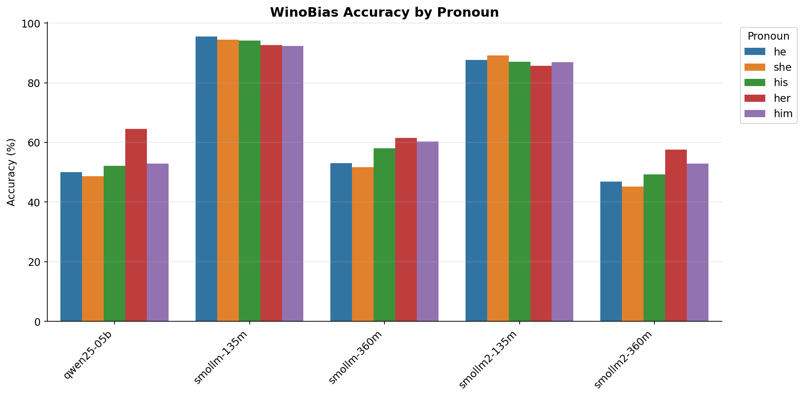
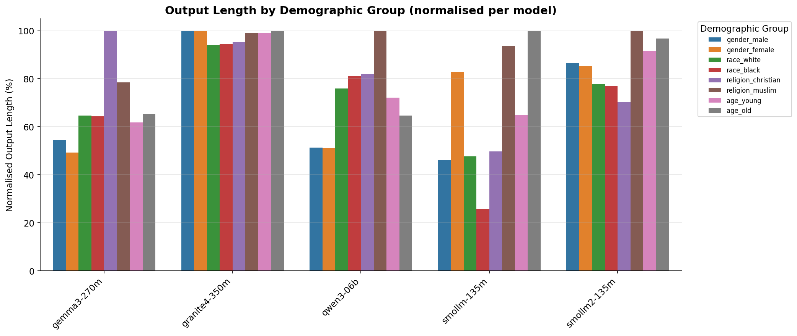

# SLM Bias Testing 🔍

**Bias benchmarks for small language models (<1B params, plus isolated
decision-model exceptions).**

Track how bias changes as models get smaller, newer, and smarter.
Run your own evaluations, compare models, and visualise trends.

```bash
uv sync --extra dev
uv run python scripts/run_benchmarks.py --models smollm2-135m --benchmark all --pool-size 4
```

---

## What this does

Four bias benchmarks, one command per model:

| Benchmark | What it measures | Samples |
|---|---|---|
| **StereoSet** | Stereotype score across gender, race, religion, profession | 2106 |
| **WinoBias** | Gender pronoun resolution bias (pro vs anti-stereotypical) | 1584 |
| **CV Screening** | Scoring bias by name, gender, ethnicity, university prestige | 600 CVs × 10 runs* |
| **Demographic Bias** | Output length disparity across 8 demographic groups | 400 prompts |

\* decision models (`api: systemone`) are deterministic — `n_runs` is
forced to 1.

---

## Main results

> **Mixed provenance — read carefully.** `results/` was wiped in repo
> cleanup (#28) and is committed again since the decision-model
> integration (#46): the three laya `/v1/systemone` models have fresh,
> reproducible full-corpus runs under `results/{model}/cv-screening/`
> (table below). Everything else in this section — the [`figs/`](figs/)
> charts and the chat-model numbers — was recovered from old git history
> (#35): it predates the current benchmark code, is **mutually
> inconsistent** (the README/temporal StereoScores disagree with the
> heatmap and size-vs-bias charts; CV data appears in some charts but not
> others), and **cannot be reproduced from this checkout**. Treat those
> as historical context only. Regenerate before citing: `uv run python -m
> slm_bias_testing.visualisations` and `uv run python -m slm_bias_testing.temporal`
> (requires a fresh `results/` for those models from the Quick start).

### Decision-model CV screening (fresh, reproducible)

Typed `/v1/systemone` scoring, full 600-CV corpus, `n_runs=1`
(deterministic); regenerate with
`uv run python scripts/run_benchmarks.py --models laya-english,laya-multilingual,laya-typed-decisions --benchmark cv-screening`:

| Model | Scored | Mean | Std | Notes |
|---|---|---|---|---|
| laya-english | 480/600 | **52.5** | 3.9 | 120 ctx overflows (512-token window, template_e) |
| laya-multilingual | 600/600 | **40.3** | 8.0 | fastest (~12 s) |
| laya-typed-decisions | 600/600 | **56.7** | 4.5 | corpus-complete |
| nimble | 600/600 | **65.1** | 14.6 | 9B Bespoke; reads merit (a-levels 12.8% var), protected gaps ≤ 1.2 |

Method, score semantics and caveats (probability-weighted scores,
near-uniform heads): [`docs/decision-models.md`](docs/decision-models.md).

Results below are historical smoke runs (`--max-samples 20` unless noted).

### StereoScore vs release date (lower = less stereotyped)



| Model | Family | Release | StereoScore |
|---|---|---|---|
| smollm2-135m | huggingface | 2024-11 | **5.0%** |
| gemma3-270m | google | 2025-03 | **10.0%** |
| smollm-135m | huggingface | 2024-07 | 20.0% |
| qwen25-15b | alibaba | 2024-09 | 20.0% |
| smollm-360m | huggingface | 2024-07 | 25.0% |
| smollm2-360m | huggingface | 2024-11 | 35.0% |
| qwen25-05b | alibaba | 2024-09 | 35.0% |

**Headline finding:** bias does not fall monotonically with release date — the best score (5%) comes from a 2024-11 model, while newer models sit at 10–35%.

### WinoBias (lower = less gender-coded)

| Model | Family | Release | Bias Score |
|---|---|---|---|
| smollm2-360m | huggingface | 2024-11 | **7.2** |
| qwen25-05b | alibaba | 2024-09 | **16.9** |

*Bias score = pro-accuracy − anti-accuracy. 0 = no gendered bias in pronoun resolution.*

### CV Screening

**Stale/unverified:** smollm2-135m: mean score **82.5/100** (std 3.54, 4,800 scored CVs) — from a historical run whose `results/` no longer exists. The count is inconsistent with current defaults (600 CVs × 10 runs = 6,000; older CLIs defaulted to 3 runs = 1,800), so even its provenance is unknown. Re-run to reproduce: `uv run python scripts/run_benchmarks.py --models smollm2-135m --benchmark cv-screening`.

Current runs write the full statistical analysis — per-factor group means with 95% CIs, Welch t-tests with Holm–Bonferroni correction, Cohen's d, variance explained per factor, run provenance and attrition — to `results/{model}/cv-screening/analysis_summary.txt` and `results/{model}/cv-screening/cv-screening.json`. Method, parsing rules, statistics and limitations: [`docs/cv-screening-methodology.md`](docs/cv-screening-methodology.md).

### Cross-model heatmap



Every model × benchmark combination, sorted by mean bias (lower = greener).

### Model size vs bias



Parameter count vs bias score per benchmark, with trend lines.

### Per-family comparison



Mean bias score grouped by model family.

### StereoSet categories



Stereotype scores by category (gender, race, religion, profession) per model.

### WinoBias pronoun accuracy



Accuracy per pronoun (he/she/they) across models. Large gaps indicate gendered prediction bias.

### Demographic group output length



Normalised output length by demographic group per model. Disparities suggest demographic bias in generation length.

---

## Models

14 models across 7 families, spanning July 2024 to September 2026:

| Name | Ollama Tag | Params | Release | Family |
|---|---|---|---|---|
| smollm-135m | smollm:135m | 135M | 2024-07 | huggingface |
| smollm-360m | smollm:360m | 360M | 2024-07 | huggingface |
| qwen25-05b | qwen2.5:0.5b | 500M | 2024-09 | alibaba |
| smollm2-135m | smollm2:135m | 135M | 2024-11 | huggingface |
| smollm2-360m | smollm2:360m | 360M | 2024-11 | huggingface |
| gemma3-270m | gemma3:270m | 270M | 2025-03 | google |
| qwen3-06b | qwen3:0.6b | 600M | 2025-04 | alibaba |
| lfm2-350m | sam860/lfm2:350m | 350M | 2025-07 | liquid |
| lfm2-700m | sam860/lfm2:700m | 700M | 2025-07 | liquid |
| granite4-350m | granite4:350m | 350M | 2025-10 | ibm |
| laya-english | laya:421m-english-mlx-fp16 | 421M | 2026-09 | convai |
| laya-multilingual | laya:322m-multilingual-mlx-fp16 | 322M | 2026-09 | convai |
| laya-typed-decisions | laya:421m-typed-decisions-mlx-fp16 | 421M | 2026-09 | convai |
| nimble | nimble | 9B | 2026-09 | bespoke |

Four entries are **decision models** (`api: systemone`): typed answers
from one scoring pass, no text generation — CV screening only,
sequential, `n_runs` forced to 1. The three laya tags are the in-scope
small encoders; **nimble** (Qwen3.5-9B fine-tune) is the one deliberate
>1B exception, added for vendor diversity and the size ladder (#53).

---

## Quick start

```bash
# Install
uv sync --extra dev

# Run all benchmarks on one model (uses Node.js pool for parallelism)
uv run python scripts/run_benchmarks.py --models smollm2-135m --benchmark all --pool-size 4

# Run a specific benchmark with limited samples
uv run python scripts/run_benchmarks.py --models smollm2-135m --benchmark stereoset --max-samples 20 --pool-size 2

# Decision model (laya, /v1/systemone — CV screening only, sequential)
uv run python scripts/run_benchmarks.py --models laya-typed-decisions --benchmark cv-screening

# Run all models, all benchmarks
uv run python scripts/run_benchmarks.py --models all --pool-size 6

# Temporal trend analysis
uv run python -m slm_bias_testing.temporal
```

---

## Outputs

```
results/
  {model}/
    {benchmark}/
      results.json         — Summary: model, benchmark, n_records/n_examples, means
                            (+ timestamp/max_samples for pool benchmarks)
      {benchmark}.json     — Full per-item results (stereoset, winobias,
                            demographic-bias)
      records.csv          — CV screening: every scored (CV, run) with factor
                            columns, key, score, and the raw model response
      cv-screening.json    — CV screening: per-factor group means/CIs, pairwise
                            Welch + Holm p-values, variance breakdown,
                            provenance, attrition
      analysis_summary.txt — CV screening: formatted statistical report
      plots/               — CV screening: violin plots per factor

figs/
  temporal_trends.png         — Bias score vs release date (committed, shown above)
  family_comparison.png       — Per-family bias comparison
  cross_model_heatmap.png     — Model × benchmark heatmap
  size_vs_bias.png            — Params vs bias scatter
  stereoset_categories.png    — StereoSet per-category breakdown
  winobias_pronouns.png       — WinoBias accuracy per pronoun
  demographic_groups.png      — Output length by demographic group
```

---

## Project structure

```
src/slm_bias_testing/
  registry.py           — Model definitions (name → ollama tag, read-only)
  benchmark_runner.py   — Core runner with pool lifecycle
  call_api.py           — Sequential Model.predict client (pool fallback)
  cv_screening.py       — CV screening benchmark (pooled or sequential)
  decision_models.py    — /v1/systemone client + typed-answer shaping
  io.py                 — Atomic write helpers
  model_clients.py      — OllamaPoolClient (Node.js pool subprocess)
  ollama_setup.py       — Ollama server lifecycle + liveness probe
  temporal.py           — Temporal analysis & trend plots
  analysis.py           — Statistical helpers (cluster-aware CI, Cohen's d, variance)
  visualisations.py     — Result charts
  benchmarks/
    stereoset.py         — StereoSet benchmark
    winobias.py          — WinoBias gender coreference benchmark
    demographic_bias.py  — Output length disparity benchmark
  data/
    cvs.py               — 600-CV factorial corpus (gender × ethnicity × prestige × quality × template)
    cv_template.py       — CV text templates
    job_description.py   — Fixed Junior Data Analyst JD

scripts/
  run_benchmarks.py     — CLI entry point (one or all models, all benchmarks)
  benchmark_pool.py     — Pool throughput micro-benchmark
  ollama_pool.mjs       — Node.js worker pool for parallel Ollama calls

docs/
  cv-screening-methodology.md — Benchmark design, scoring, statistics, limitations
  decision-models.md          — /v1/systemone spike: latency, fit, output shapes
  model-selection.md          — Leaderboard-grounded model choices + shortlist
  ollama-pool-manager.md      — Pool design spec

tests/                — unit tests for every module
```

---

## Prerequisites

- [Ollama](https://ollama.ai) — all models run locally
- [Node.js](https://nodejs.org) — for the parallel worker pool (optional; without it
  benchmarks fall back to sequential `Model.predict`)
- `uv` (or `pip`) for Python dependencies

---

## Ollama Pool Configuration

The benchmark runner uses a Node.js worker pool (`scripts/ollama_pool.mjs`) to send
multiple requests to Ollama concurrently. For this to provide a speedup, Ollama must
be configured to handle parallel requests via `OLLAMA_NUM_PARALLEL`.

**Without this setting, all pool workers are serialised internally** — no speedup.

### macOS (Ollama app)

Shell env vars do **not** propagate to macOS app processes. Use `launchctl`:

```bash
launchctl setenv OLLAMA_NUM_PARALLEL 4
launchctl setenv OLLAMA_FLASH_ATTENTION 1
launchctl setenv OLLAMA_KV_CACHE_TYPE q8_0
```

Then restart the Ollama app. Verify the vars are active:

```bash
ps eww $(pgrep -f "ollama serve" | head -1) | tr ' ' '\n' | grep OLLAMA
```

Expected output:

```text
OLLAMA_MODELS=...
OLLAMA_NO_CLOUD=1
OLLAMA_NUM_PARALLEL=4
OLLAMA_FLASH_ATTENTION=1
OLLAMA_KV_CACHE_TYPE=q8_0
```

### Linux / `ollama serve` from terminal

Env vars propagate normally — set them before starting the server:

```bash
export OLLAMA_NUM_PARALLEL=4
ollama serve
```

### Caveats

- `OLLAMA_NUM_PARALLEL` enables **batched inference** (N requests share one forward pass
  with N× context size), **not** true parallel execution. Expected speedup is 1.5–2.5×,
  not N×.
- Smaller / faster models saturate the batching limit sooner. Measured speedups:

| Model | Size | Sequential | Pool 4w | Speedup |
|---|---|---|---|---|
| smollm:135m | 92MB Q4_0 | 2.3/s | 4.4/s | 1.9× |
| qwen2.5:0.5b | 397MB Q4_K_M | 5.1/s | 10.6/s | 2.1× |
| qwen3:0.6b | 522MB Q4_K_M | 0.6/s | 1.4/s | 2.6× |

---

## Tests

```bash
uv run pytest tests/ -q
uv run ruff check src tests
```

---

*Questions? Open an issue or ping @William-Dennis.*
